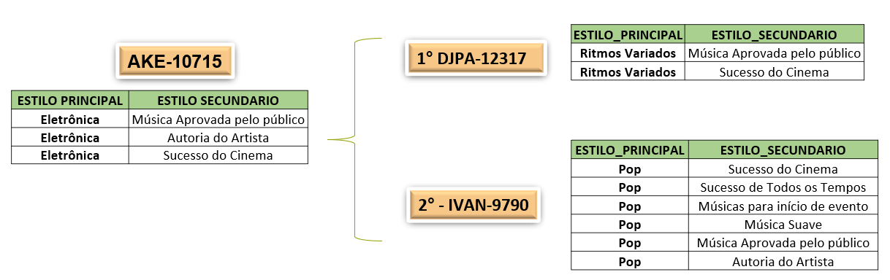

# Sistema de Recomendação de Artista para Estabelecimentos

___

___
## Contéudo
Sistema de recomendação são algoritmos que utiliza variadas técnicas computacionais combinadas que procura prever a "avaliação" e/ou "preferência" de itens ao usuário. Este sistema de recomendação são utilizados nas mais diversas áreas.

___
## Objetivo
Recomendação de Artista
___
## Objetivo Específico
Recomendação de Artistas para Bares.
___

## Propósito
    Nosso modelo de Algoritmo tem a pretensão de estimar/predizer se um Artista do nosso portfolio tem os mesmos qualitativos, features, para ser uma recomendação assertiva de continuação do projeto musical do bar.
    Nas recomendações dos Artistas para Bares ocorrerão uma renovação sutil para manter o perfil do estabelecimento e a rotatividade dos artistas.

___

### Análise Exploratória de dados:
        * Quantidade de estabelecimento;
        * Quantidade de Artistas;
        * Quantidade de Propostas;
        * Estabelecimento com maior número de propostas;
        * Estilo musical mais tocado.
___
### Insight
* Análise dos estilos musicais mais tocados:
        Top -  Estilo prinicipal e secundário.
* Análise dos melhores artistas por estilo.
* Análise de artistas similares.

___

### Dataset

___
### Projeto:

Sistema de recomendação:
* Filtragem baseada em conteúdo LightFM .

Essa abordagem utiliza uma série de característica discretas de um item (estabelecimento) para recomendar (artistas) com propriedades semelhantes.

Análises:

1 - Realiza a análise do estilo musical de cada estabelecimento;
2 - Realiza a análise do estilo musical de cada artista;
3 - Algoritmo prever as similaridades entre os dois itens e faz a devolutiva com a recomendação. 

### Tecnologia:

### Dependências:

___

### Deploy

___
### Referências Bibliograficas
KNN  - https://scikit-learn.org/stable/modules/neighbors.html

LIGHTFM - https://making.lyst.com/lightfm/docs/home.html

Sistema de recomendação: https://www.supero.com.br

___
### Código fonte:
 * Recomendador de artista com filtragem colaborativa baseada em itens KNN;
 * Recomendador de artista com  filtragem baseada em conteúdo baseada em LightFM
___
### Orientador
 * Wagner Maurício Nunes dos Santos

___
## Equipe desenvolvedora:
* Adgelson Gomes 
* Bruno Farias  
* Eduardo Iwasaki
* Nilva Pires

___

🔸Projeto Integrador - Digital House 🔸Ciências de Dados 🔸2023
