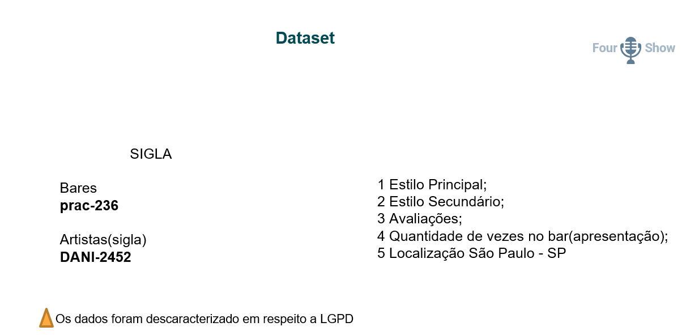
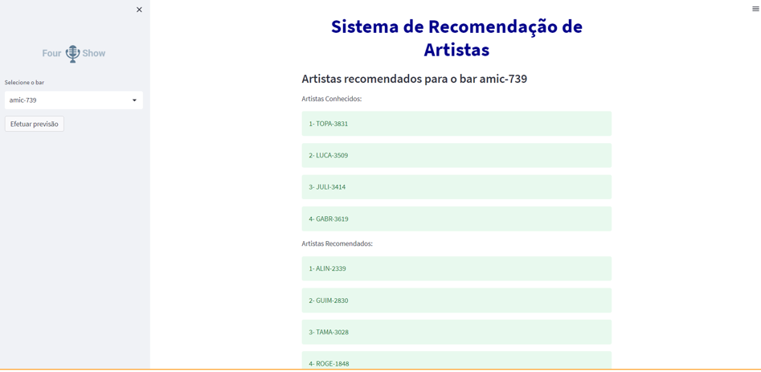

# Sistema de Recomendação de Artista para Estabelecimentos

___

___
## Contéudo:
Sistema de recomendação são algoritmos que utiliza variadas técnicas computacionais combinadas que procura prever a "avaliação" e/ou "preferência" de itens ao usuário. Este sistema de recomendação são utilizados nas mais diversas áreas.

___
## Objetivo:
Recomendação de Artista
___
## Objetivo Específico:
Recomendação de Artistas para Bares.
___

## Propósito:
    Nosso modelo de Algoritmo tem a pretensão de estimar/predizer se um Artista do nosso portfolio tem os mesmos qualitativos, features, para ser uma recomendação assertiva de continuação do projeto musical do bar.
    Nas recomendações dos Artistas para Bares ocorrerão uma renovação sutil para manter o perfil do estabelecimento e a rotatividade dos artistas.

___

### Análise Exploratória de dados:
        * Quantidade de estabelecimento;
        * Quantidade de Artistas;
        * Quantidade de Propostas;
        * Estabelecimento com maior número de propostas;
        * Estilo musical mais tocado.
___
### Insight 📈:
* Análise dos estilos musicais mais tocados:

        Top -  Estilo prinicipal e secundário.
* Análise dos melhores artistas por estilo.
* Análise de artistas similares.

___

### Dataset:

___
### Sobre o projeto:

Sistema de recomendação 🎯:
* Filtragem baseada em conteúdo LightFM.

Essa abordagem utiliza uma série de característica discretas de um item (estabelecimento) para recomendar (artistas) com propriedades semelhantes.

Análises:

1 - Realiza a análise do estilo musical de cada estabelecimento;

2 - Realiza a análise do estilo musical de cada artista;

3 - Algoritmo prever as similaridades entre os dois itens e faz a devolutiva com a recomendação. 

___

### Tecnologia:

### Dependências:

### Database:

### Deploy:

### Apresentação:

___
### Instruções 📌:
- Clonar o repositório
$ git clone https://github.com/nilva2020/Recommendation_System
- Acessar Jupyter notebook
  efetuar o upload dos arquivos .py e data
- Instalar ou importar as dependências
   Numpy, Pandas, Matplotlib, Seaborn,
- Run

___

### Referências Bibliograficas:
KNN  - https://scikit-learn.org/stable/modules/neighbors.html.

LIGHTFM - https://making.lyst.com/lightfm/docs/home.html.

Python - https://pypi.org/

Referência de estudo -  https://www.kaggle.com/code/camiloemartinez/sistemas-de-recomendacion-con-surprise-y-lightfm.

Referência de estudo: https://www.supero.com.br

___
### Código fonte:
 * Recomendador de artista com filtragem colaborativa baseada em itens KNN;
 * Recomendador de artista com  filtragem baseada em conteúdo baseada em LightFM
___

### Orientador:
 * 🎓Wagner Maurício Nunes dos Santos

___
## Equipe Integradora:

[ **Adgelson Gomes**](https://github.com/Gelsonbrasilia) 

___

[ **Bruno Farias**](https://github.com/buirf)

  
___

[ **Eduardo Iwasaki**](https://github.com/EduardoMassa)

___

[ **Nilva Pires**](https://github.com/nilva2020)    

 

___

🔸Projeto Integrador - Digital House 🔸Ciências de Dados 🔸2023
